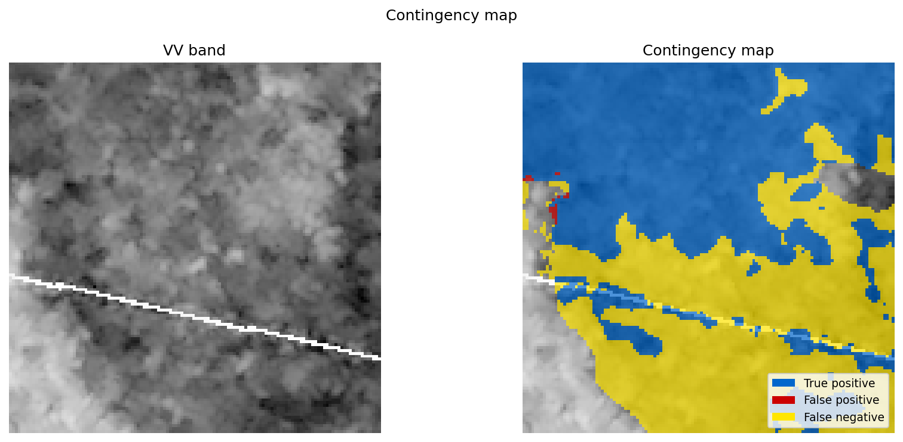

# Sentinel Flood Mapper

A deep learning pipeline for flood extent mapping from Sentinel-1 Synthetic Aperture Radar (SAR) imagery, combining the Sen1Floods11 and STURM-Flood datasets to train a U-Net segmentation model. 


---

## Results 

The model was evaluated on a held-out test set of five flood events (Bolivia, Spain, EMSR279, EMSR397, EMSR416) that were excluded from training and validation entirely. 

| Metric | Val | Test |
|--------|-----|------|
| IoU | 0.7114 | 0.6128 |
| F1 | 0.8314 | 0.7599 |
| Precision | — | 0.8719 |
| Recall | — | 0.6735 |
| Accuracy | — | 0.9162 |

For comparison, the STURM paper's U-Net baseline trained on Sentinel-1 data achieved a water class F1 of 0.70. The Sen1Floods11 paper's best model on the Bolivia holdout achieved a flood water IoU of 0.3296. This model achieves a mean IoU of 0.4292 across all 15 Bolivia inference chips; this includes chips with extensive nodata regions and flood-free scenes which bring the mean down considerably.  

  

*Contingency map on a test set tile. Blue: true positives, red: false positives, yellow: false negatives.*

---

## Overview 

Flood mapping from satellite imagery is a critical component of disaster response and humanitarian relief. Sentinel-1 SAR is particularly valuable for this task because its radar signal penetrates cloud cover, enabling flood detection regardless of weather conditions - a significant advantage over optical sensors during active flood events. 

This project trains a binary segmentation model to classify each pixel in a Sentinel-1 SAR image as flood or non-flood. The model operates on dual-polarisation (VV and VH) SAR backscatter and produces a georeferenced probability map and binary flood mask as output. 

---

## Datasets

Two publicly available datasets are combined for training: 

**Sen1Floods11** (Bonafilia et al., 2020) contains 446 hand-labelled 512x512 pixel chips of Sentinel-1 SAR imagery from 11 flood events across six continents. Labels were created by trained analysts using coincident Sentinel-2 imagery as reference. 

**STURM-Flood** (Notarangelo et al., 2025) contains 21,602 pre-tiled 128x128 pixel Sentinel-1 chips from 60 flood events globally, with labels derived from the Copernicus Emergency Management Service. The dataset provides substantially more geographic and climatological diversity than Sen1Floods11 alone. 

Combined, the two datasets provide 28,721 tiles across 71 flood events after preprocessing.  

### Preprocessing 

Sen1Floods11 chips are preprocessed as follows before tiling: 

1. NaN values (representing areas outside the SAR acquisition swath) are replaced with 0.0 
2. A Lee speckle filter (window size 7) is applied to reduce multiplicative noise, matching the preprocessing applied to STURM tiles 
3. Values are clipped to the range [-30, +10] dB and min-max normalised to [0, 1] 
4. Chips are tiled into non-overlapping 128x128 pixel tiles 

STURM tiles are already normalised and tiled at 128x128 pixels. Only label remapping to a binary water/non-water scheme is applied.  

Labels from both datasets are remapped to a binary scheme: 0 for non-water, 1 for water and 255 for nodata pixels. Nodata pixels are excluded from both loss computation and metric evaluation throughout. 

--- 

## Split Strategy

The test set comprises five flood events held out entirely at event level - Bolivia (Sen1Floods11), Spain (Sen1Floods11), EMSR279, EMSR397 and EMSR416. Holding out entire events ensures the test set represents genuine generalisation to unseen flood scenarios with different geographic and acquisition characteristics. Train and val are formed by randomly splitting all remaining tiles 85/15 at tile level. Final counts: Train 23,098 - Val 4,076 - Test 1,564.  

---

## Architecture 

The model is a U-Net with a pretrained EfficientNet-B0 encoder from the `segmentation-models-pytorch` library. The first convolutional layer is adapted to accept 2-channel SAR input (VV and VH).  

Using ImageNet-pretrained encoder weights provides a meaningful benefit even for SAR data. The early layers of the encoder learn general spatial feature detectors that transfer across modalities. The later layers are fine-tuned on the SAR flood detection task during training.  

**Loss function**: Combined Binary Cross Entropy and Dice loss with equal weighting. BCE provides stable per-pixel gradients throughout training. Dice loss directly optimises the overlap metric and handles the class imbalance naturally. A positive class weight of 3.0 in the BCE component reflects the approximate 1:3 flood to non-flood pixel ratio.  

**Optimiser**: Adam with learning rate 1e-4 and weight decay 1e-4. 

**Scheduler**: ReduceLROnPlateau monitoring validation IoU with patience 5 and reduction factor 0.5, down to a minimum of 1e-6. 

**Early stopping**: Patience of 20 epochs based on validation IoU. 

Training converged at epoch 45. 

---

## Project Structure 

```
Sentinel-Flood-Mapper/
├── assets/                       # Images referenced in README
├── config/
│   └── default.yaml              # All configuration
├── data/
│   ├── raw/                      # Raw datasets (not tracked by Git)
│   │   ├── Sen1Floods11/
│   │   └── STURM/
│   ├── processed/                # Preprocessed tiles (not tracked by Git)
│   ├── inference_examples/       # Bolivia chips for inference (not tracked)
│   └── event_splits.csv          # Tile-level train/val/test assignments
├── notebooks/
│   ├── 01_exploration.ipynb      # Dataset exploration
│   ├── 02_train.ipynb            # Preprocessing and training pipeline
│   ├── 03_evaluate.ipynb         # Test set evaluation
│   ├── 04_predict.ipynb          # Inference on Bolivia chips
│   ├── test_visualise.ipynb      # Visualisation function testing
│   └── notebooks_utils.py        # Shared notebook utility functions
├── outputs/
│   ├── checkpoints/              # Model checkpoints (not tracked by Git)
│   ├── figures/                  # Training curves and evaluation plots
│   └── inference/                # Inference outputs (not tracked by Git)
├── sentinel_flood_mapper/        # Python package
│   ├── config.py
│   ├── data/
│   │   ├── dataset.py
│   │   ├── preprocess.py
│   │   ├── splits.py
│   │   ├── transforms.py
│   │   └── inference_examples.py
│   ├── models/
│   │   ├── unet.py
│   │   ├── losses.py
│   │   ├── metrics.py
│   │   ├── train.py
│   │   ├── evaluate.py
│   │   └── predict.py
│   ├── pipelines/
│   │   ├── training_pipeline.py
│   │   ├── evaluation_pipeline.py
│   │   └── inference_pipeline.py
│   └── utils/
│       ├── visualise.py
│       └── checkpoint.py
├── environment.yml
├── pyproject.toml
├── LICENSE
└── README.md
```

---

## Installation 

**Requirements**: Python 3.12, CUDA-capable GPU recommended. 

Clone the repository: 

```bash
git clone https://github.com/kimbielby/Sentinel-Flood-Mapper.git
cd Sentinel-Flood-Mapper
```

Create and activate a conda environment with Python 3.12: 

```bash
conda env create -f environment.yml
conda activate floodmapper
```

Note: `environment.yml` installs PyTorch for CUDA 13.0. If your system uses a different CUDA version, edit the torch and torchvision lines before running the above. Visit [pytorch.org](https://pytorch.org/get-started/locally/) to find the correct install URL for your CUDA version.

Install the package in editable mode: 

```bash
pip install -e .
``` 

---

## Data 

Download the datasets and place them as follows: 

**Sen1Floods11**: Download from [github.com/cloudtostreet/Sen1Floods11](https://github.com/cloudtostreet/Sen1Floods11). Place the `S1Hand` and `LabelHand` directories at `data/raw/Sen1Floods11/`. 

**STURM-Flood**: Download from [zenodo.org](https://zenodo.org/records/14867154). Place the Sentinel-1 data at `data/raw/STURM/Sentinel1/` with `S1/` and `Floodmaps/` subdirectories.  

--- 

## Usage 

Open the notebooks in your IDE and run them in order. 

**`01_exploration.ipynb`** - explores the raw datasets, visualises sample chips and label distributions. 

**`02_train.ipynb`** - runs the full training pipeline: preprocessing, split creation, dataloader construction and model training. Preprocessing only runs once and is skipped automatically on subsequent runs if processed tiles already exist.

**`03_evaluate.ipynb`** - evaluates the trained model on the held-out test set and saves metrics and visualisations to `outputs/figures/`.

**`04_predict.ipynb`** - runs inference on the Bolivia inference examples. To run inference on a single chip instead of the full directory, uncomment the `image_path` and `label_path` parameters and comment out `image_dir` and `label_dir`. For large images that would not fit in GPU memory as a single forward pass, set `use_tiling=True` and uncomment the stride parameter.

Three output files are saved per chip to `outputs/inference/`: 
- `*_prediction_prob.tif` - float32 probability map, georeferenced
- `*_prediction_binary.tif` - uint8 binary flood mask (0/1), georeferenced 
- `*_contingency.png` - contingency map visualisation (only when ground truth is provided)

The pipeline expects raw Sentinel-1 GRD imagery in dB scale with VV and VH polarisation bands. The same preprocessing as training is applied automatically.

---

## Testing 

Run the test suite from the project root: 

```bash
pytest tests/ -v 
```

## Pre-trained Model 

The trained model checkpoint is available from the [GitHub Releases page](https://github.com/kimbielby/Sentinel-Flood-Mapper/releases/tag/v1.0.0). 

Download `best_model.pt` and place it at `outputs/checkpoints/best_model.pt` before running evaluation or inference. 

---

## Limitations

**Flooded vegetation**: SAR backscatter from flooded vegetation can be ambiguous or even elevated due to double-bounce scattering effects. The model tends to miss flood pixels in vegetated areas, which is reflected in the recall of 0.674 on the test set. 

**Nodata regions**: Areas outside the SAR acquisition swath contain no backscatter information and are treated as nodata. These pixels are excluded from metrics but receive flood predictions if they border valid flood pixels. The NaN-to-zero replacement can cause false positives at swath boundaries in some cases. 

**Geographic generalisation**: The model was trained on flood events primarily from Europe, Asia and South America. Performance on flood events in underrepresented geographic regions or unusual land cover types may be lower than reported metrics suggest. 

**Single acquisition**: The model uses a single post-flood SAR acquisition without a pre-flood reference. Change detection approaches using pre- and post-flood imagery pairs typically outperform single-image methods, particularly in urban areas where permanent water and flooded areas have similar backscatter signatures. 

--- 

## References 

Bonafilia, D., Tellman, B., Anderson, T., & Issenberg, E. (2020). Sen1Floods11: A georeferenced dataset to train and test deep learning flood algorithms for Sentinel-1. *Proceedings of the IEEE/CVF Conference on Computer Vision and Pattern Recognition Workshops*, 210–211.

Notarangelo, N. M., Wirion, C., & van Winsen, F. (2025). STURM-Flood: A curated dataset for deep learning-based flood extent mapping leveraging Sentinel-1 and Sentinel-2 imagery. *Big Earth Data*. https://doi.org/10.1080/20964471.2025.2458714

Iakubovskii, P. (2019). Segmentation Models PyTorch. GitHub. https://github.com/qubvel/segmentation_models.pytorch  

---

## License 

This project is licensed under the MIT License. See [LICENSE](LICENSE) for details. 


